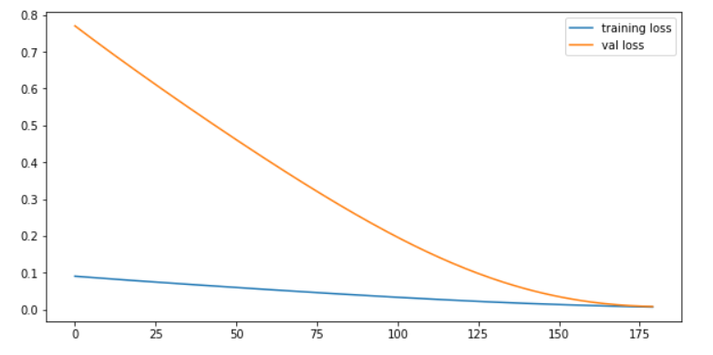
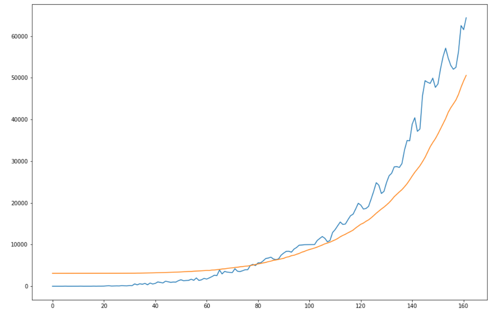

# CovidPredictionRNN
- Pytorch LSTM RNN to speculate number of positive cases of COVID-19 using data-set provided by WHO collected over 8 months

- Training loss and validation loss over epochs:

- Predicted Trend v/s Real Data:

**Accuracy : 88.803 %** (over training data)
